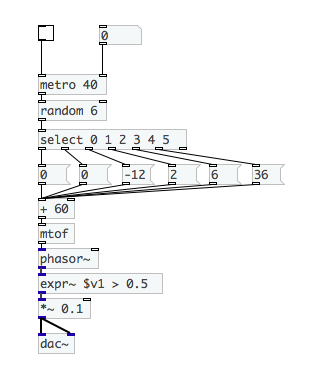
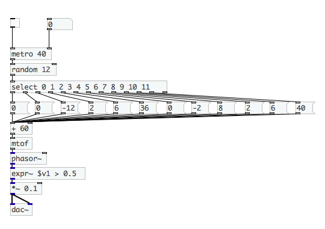
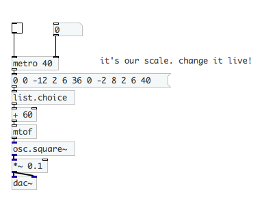
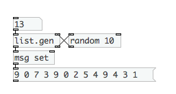
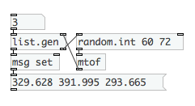
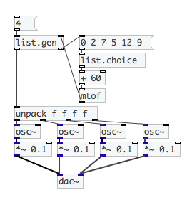
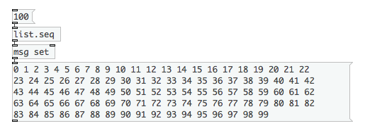
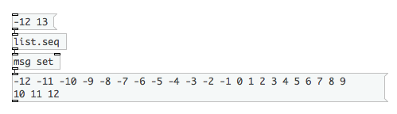
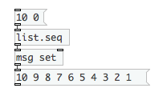

# List externals

For generative music lists are simpler and more effective then manipulating single values.

This tutorial covers all basic lists manipulation in CEAMMC library.

## [list.choice]

> choose random element from input list
>
> _input:_ ***list***
>
> _output:_ ***atom***

Let's try to make 8-bit random generator using vanilla objects and CEAMMC objects.
For example, we don't need all random notes, we have some scale and want to use
notes only from this scale.

### vanilla version

_(click on images to download Pd patch)_

It's simple, but what if we want to add some values to scale live?
It will require some time and patching. We need:

- add new change ![[random]](obj/random.png) limit to other value
- change ![[select]](obj/select.png) values
- make new message boxes and connect them to ![[mtof]](obj/mtof.png) object

So it's take time to get result like this:

As you can see every scale change requires a lot of manipulations: doing connections and
objects creating/modification.

But if we will use lists the things are much simple, we just to need pick random element
from list. And there is object for this task: .
Every time it receives list, it outputs random element from it.
So live scale change only require to change list itself.

Here's list version with CEAMMC objects:

### list version

Another useful object is 

## [list.gen]

> generate list of arbitrary length with external generator algorithm.
>
> _input:_ ***number***
>
> _output:_ ***list***

It allows to generate lists. When it receives number, it sequentially
outputs this number of bangs to rightmost outlet. This bangs are intended
for **generator** object.
It could be any object or abstraction that satisfies to this conditions: upon
bang it outputs some value.
The output of generator should be connected to rightmost
inlet .
After all values from generator are received,
they are packed into list and outputted.

To produce list of constants:

To produce list of random numbers >= 0 and < 10:

To produce list of random notes frequencies in first octave:

Random chord generator with specified modus:

## [list.seq]

> generates numeric sequence of arbitrary length
>
> _input:_ ***list*** or ***number***
>
> _output:_ ***list***

This produces list with numbers from 0 to 99:

This produces list with numbers from -12 to 12:

This produces list with numbers from 10 to 1:

___________________

_by Serge Poltavski_
